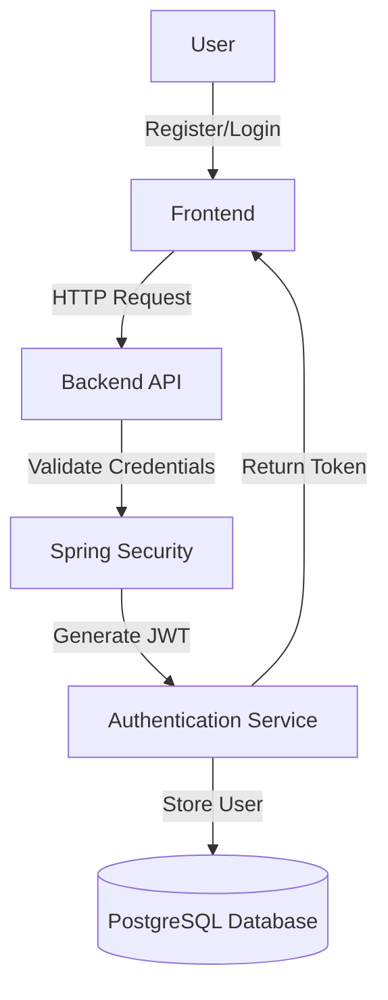

# Vital Essence Project 🌟

## Overview

**Vital Essence** is a comprehensive web application designed for secure user authentication and management, combining robust backend services with an intuitive frontend interface.

### Key Components

| Component | Description | Technologies |
|-----------|-------------|--------------|
| 🖥️ Frontend | Lightweight, user-friendly interface | HTML, CSS, Vanilla JavaScript |
| 🔒 Backend | Secure authentication system | Spring Boot, JWT, Spring Security |
| 💾 Database | Persistent user data storage | PostgreSQL |

### Project Objectives

- 🛡️ Implement a secure, scalable authentication system using JWT
- 👤 Create an intuitive user management platform
- 📧 Develop email-based notification and recovery features
- 🧩 Ensure high maintainability and extensibility

## System Architecture

### Authentication Flow



## Technical Setup

### Prerequisites

#### Requirements
- ☕ Java 17+
- 🏗️ Maven or Gradle
- 🗃️ PostgreSQL 13+
- 🖥️ IDE (IntelliJ IDEA, Eclipse)

### Installation Guide

#### Setup
```bash
# Navigate to backend directory
cd server

# Run PostgreSQL with Docker
docker run -d --name vital-essence-db \
    -p 6000:5432 \
    -e POSTGRES_USER=your_user \
    -e POSTGRES_PASSWORD=your_password \
    -e POSTGRES_DB=vital_essence
```

## API Endpoints

### User Registration
- **Endpoint:** `POST /auth/register`
- **Purpose:** Create a new user account

#### Request Parameters
- `username`: 3-50 characters (unique)
- `password`: Minimum 8 characters, alphanumeric
- `email`: Valid email format

#### Response Scenarios
| Status Code | Description |
|------------|-------------|
| 201 | User created successfully |
| 400 | Invalid input data |
| 409 | Username or email already exists |

### Planned Features
- 📧 Email notifications
- 🔑 Password reset functionality
- 🔒 Enhanced security mechanisms

## Security Considerations

### Authentication Strategies
- JWT-based stateless authentication
- Spring Security integration
- Bcrypt password hashing
- Token-based password reset mechanism

### Email Configuration
```properties
spring.mail.host=smtp.gmail.com
spring.mail.port=587
spring.mail.username=your-email@gmail.com
spring.mail.properties.mail.smtp.auth=true
spring.mail.properties.mail.smtp.starttls.enable=true
```

## Future Roadmap
- [x] Implement comprehensive email services
- [ ] Enhance password management
- [ ] Add multi-factor authentication
- [ ] Develop advanced user roles and permissions

---

**Note:** Always use environment variables and secure practices for sensitive configuration details.
